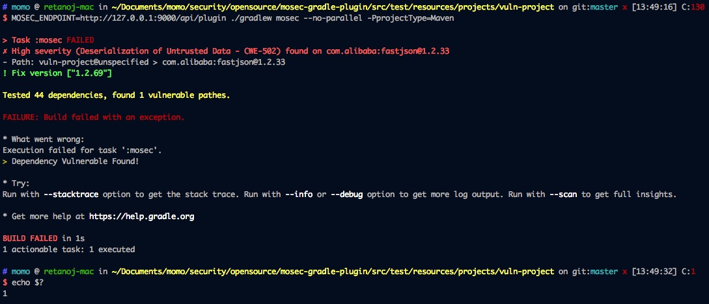
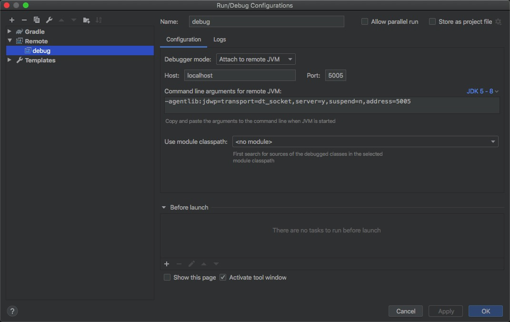

# MOSEC-GRADLE-PLUGIN

用于检测gradle项目的第三方依赖组件是否存在安全漏洞。

该项目灵感来自 [snyk-gradle-plugin](https://github.com/snyk/snyk-gradle-plugin.git) 。


## 关于我们

Website：https://security.immomo.com

WeChat:

<br>


## 版本要求

Gradle >= 3.0


## 安装

向顶层build.gradle中增加如下配置
```groovy
// file: build.gradle

buildscript {
    repositories {
        maven { url "https://raw.github.com/momosecurity/mosec-gradle-plugin/master/mvn-repo/" }
    }

    dependencies {
        classpath 'com.immomo.momosec:mosec-gradle-plugin:latest.release'
    }
}

allprojects {
    apply plugin: 'mosec'
}
```


## 使用

首先运行 [MOSEC-X-PLUGIN Backend](https://github.com/momosecurity/mosec-x-plugin-backend.git)

#### 命令行使用

```shell script
# 对于所有projects，Maven项目
> MOSEC_ENDPOINT=http://127.0.0.1:9000/api/plugin \
  ./gradlew --no-parallel \
  mosec -PprojectType=Maven -PonlyProvenance=true

# 对于单个project，Maven项目
> MOSEC_ENDPOINT=http://127.0.0.1:9000/api/plugin \ 
  ./gradlew --no-parallel \
  :demo:mosec -PprojectType=Maven -PonlyProvenance=true

# 对于 Android 项目，使用 confAttr 参数
> MOSEC_ENDPOINT=http://127.0.0.1:9000/api/plugin \ 
  ./gradlew --no-parallel \
  mosec -PprojectType=Android -PconfAttr=buildtype:release -PonlyProvenance=true
```


## 帮助

```shell script
> mosec -PseverityLevel=Medium      // 调整威胁等级 [High|Medium|Low], 默认 High
> mosec -PonlyProvenance=true       // 仅检查直接依赖, 默认 false
> mosec -PprojectType=Maven         // 项目类型 [Maven|Android], 默认 Android
> mosec -PfailOnVuln=true           // 发现漏洞即编译失败, 默认 true
```


## 使用效果

以 src/test/resources/projects/vuln-project 项目为例。

红色部分给出漏洞警告，Path: 为漏洞依赖链，Fix version 为组件安全版本。

程序返回值为1，表示发现漏洞。返回值为0，即为未发现问题。




## 检测原理

MOSEC-GRADLE-PLUGIN 核心使用 org.gradle.api.artifacts.ResolvedConfiguration#getFirstLevelModuleDependencies() 接口获取依赖，并构建依赖树。

该方法可以准确提取Gradle项目所使用的依赖，以及确定的依赖版本。

最终依赖树会交由 [MOSEC-X-PLUGIN-BACKEND](https://github.com/momosecurity/mosec-x-plugin-backend.git) 检测服务进行检测，并返回结果。

相关数据结构请参考 MOSEC-X-PLUGIN-BACKEND [README.md](https://github.com/momosecurity/mosec-x-plugin-backend/blob/master/README.md).


## 开发

#### Intellij 远程调试 Gradle 插件

1.将mosec-gradle-plugin安装至本地仓库

2.git clone mosec-gradle-plugin

3.Intellij 中新建 Remote Configuration 并填入如下信息



4.在另一个gradle工程中执行如下命令

```shell script
> ./gradlew --no-parallel --no-daemon mosec -Dorg.gradle.debug=true
```

5.回到Intellij中，下断点，开始Debug
